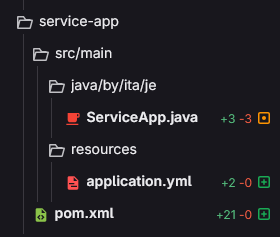
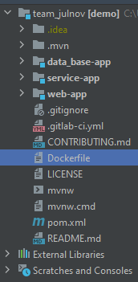

# JE 140

### Формат МР(запросов на слияни веток)
  * Название ветки должно соотвествовать паттеру
    * "<фамилия>-<цифра>-<цифра>" (все буквы с строчные) - "wasileuski-1-3"
  * Название(title) МР
    * "<ITA>:<фамилия> <цифра>-<цифра>" - "ITA: wasileuski 1-3"

## Задачи Первого модуля

### 1.1.0 Задание
  * Создание мультимодульного проекта с помощью Maven
  * Название модулей: 
    * web-app,
    * data-base-app, 
    * service-app
  * В каждом модуле должна быть идентичная структура корневых каталогов
      * /src/main/java/by/ita/je/
      * /src/test/java/by/ita/je/
  * Каждый модуль полностью независим и собирается в jar файл

#### 1.1.1
  * Отредактируйте pom файл, который общий для всех модулей
```
    <groupId>by.ita</groupId>
    <artifactId>je140</artifactId>
    <version>0.0.1-SNAPSHOT</version>
    <packaging>pom</packaging>

    <name>demo</name>
    <description>Demo project for Spring Boot</description>
    <modules>
      <module>web-app</module>
      <module>data-base-app</module>
      <module>service-app</module>
    </modules>
```
  * Для каждого из модулей создайте класс для старта Spring-Boot приложения в каждом модуле раздельно. Структура должна соответствовать этой:
  
  
  * Классы для старта должны именоваться соответственно
    * Для web-app - WebApp.java 
    * data-base-app - DataBase.java
    * service-app - ServiceApp.java
  Незбывайте про аннотации в этих классах `@SpringBootApplication`
  * Добавьте в каждый модуль файл `application.yml`, который должен находиться по пути src/main/resources/application.yml
  Файл должен содержать настройки для сервера приложение , а точнее номер порта соответственно:
    * web-app - 8091
    * data-base-app - 8101
    * service-app - 8111
    
  Пример:
  ```
    server:
      port: 8091
  ```
  * Удалите лишние каталоги, что бы структура кода выглядила так:
  
  

## Задачи второго модуля
### 2.1 Задание
* Соблюдайте правила "слоения" и структуру папок в проекте, `SOLID` принципы!
* В модуле `data-base-app` создать 4 сущности `MODEL`, разного назначения.
    * Пользоваться Ломбоком, нельзя! см пример https://projectlombok.org/features/Builder
    * В каждой сущности должно быть минимум 8 полей, не больше 2 одинаковых типов полей на класс.
    * Сущности должны собираться через паттерн `Builder`.
    * В каждой сущности должно быть одно поле типа `ZoneDateTime`.
* В модуле `data-base-app` создать 4 сущности `DTO` согласно вашим моделям.
    * В ваших `DTO` не должны быть показано поле `ZoneDateTime` типа.
    * `DTO` должны иметь в общем на 2 поля меньше чем соответствующая `MODEL`. 6 полей минимум.
    * `DTO` должен так же конструироваться билдером.
* В модуле `data-base-app` создать `REST` контроллеры, для `CRUD` задач под каждую созданную `DTO`(отдельный класс контроллер для каждой дто).
    * Чтение всех записей, удаление списком.
    * Следите за маппингами ваших методов контроллера, разделителем слов может быть только "/", все слова в маппинге пишутся строго строчными буквами.
    * Маппинг контроллеров должен содержать существительные/инфинитивы, говорящие о назначении эндпоинта.
    * Контроллеры должны возвращать ответы `DTO` сущностями в формате `JSON`. https://www.json.org/json-en.html

### 2.3 Задание
  * Установите `Postman` и проверьте все ваши контроллеры.
    * Создайте коллекцию в `Postman`, с папками для каждого из ваших контроллеров. (cм запись лекции)
    * В каждой папке, должны быть сохранены все запросы на контроллер.
    * Создайте папку `postman` в модуле `data-base-app` и экспортируйте туда свою коллекцию.

### 2.4 Задание
  * Вы можете перевести все ваши модели и дто на ломбок.
  * Вы можете сделать это самостоятельно по гайду https://www.baeldung.com/intro-to-project-lombok
  * В следующих заданиях можете полноценно использовать ломбок для ваших `POJO`.

### 2.5 Задание
* Необходимо добавить в модуль `data-base-app` работу с БД через `JDBCTemplate`.
* Добавтьте необходимые зависимости в модуль
```xml
        <dependency>
            <groupId>org.springframework.boot</groupId>
            <artifactId>spring-boot-starter-data-jpa</artifactId>
        </dependency>
```
Эта зависимость позволяет вам использовать разлиные библиотеки для работы с БД в Спринг
```xml
        <dependency>
            <groupId>com.h2database</groupId>
            <artifactId>h2</artifactId>
        </dependency>
```
Эта зависимость позволяет использовать одну из реализаций БД, для вашего приложения.
* Настройте автоконфигурирование для вашей БД, добавьте настройки в `application.yml` примерно такие:
```yaml
spring:
  datasource:
    url: jdbc:h2:mem:testdb
    username: sa
    password: sa
    driver-class-name: org.h2.Driver
    initialization-mode: always
  h2:
    console:
      enabled: true
      path: /h2-console
      settings.web-allow-others: true
```
* Для каждой модели вам необходимо сделать скрипт создания и заполнения БД (см. запись лекции), пример:
```sql
CREATE TABLE ANIMAL(uuid CHAR(36) PRIMARY KEY, appeared TIMESTAMP WITH TIME ZONE, name VARCHAR(255), price DECIMAL, weight DECIMAL, size DECIMAL,isCarnivore BOOLEAN, isPredator BOOLEAN);
INSERT TNTO ANIMAL(id, appeared, name, price, weight, size,isCarnivore, isPredator) VALUES (...);
INSERT TNTO ANIMAL(id, appeared, name, price, weight, size,isCarnivore, isPredator) VALUES (...);
INSERT TNTO ANIMAL(id, appeared, name, price, weight, size,isCarnivore, isPredator) VALUES (...);
INSERT TNTO ANIMAL(id, appeared, name, price, weight, size,isCarnivore, isPredator) VALUES (...);
```
* В скриптах, должно быть добавленно как минимум 4 строк добавленния данных.

### 2.6 Задание
* Соблюдайте правила "слоения" и структуру папок в проекте, `SOLID` принципы!
* В модуле `data-base-app` создайте новый слой для сервисов в папке `services`.
* В папке `services` создайте компоненты для каждой из моделей соотвественно
* Интегрируйте в компоненты сервисов `JDBCTemplate` где будете выполнять запросы к БД, с помощью SQL запросов
  * jdbcTemplate.queryForObject(...) - для получениея записей
```java
  public Animal findAnimalById(UUID uuid) {
    String sql = "SELECT * FROM ANIMAL WHERE uuid = ?";
    return jdbcTemplate.queryForObject(sql, new RowMapper<Animal>() {
        @Override
        public Animal mapRow(ResultSet rs, int rowNum) throws SQLException {
            UUID uuid = UUID.fromString(rs.getString("uuid"));
            LocalDate appeared = rs.getDate("appeared").toLocalDate();
            String name = rs.getString("name");
            double price = rs.getDouble("price");
            double weight = rs.getDouble("weight");
            double size = rs.getDouble("size");
            boolean isCarnivore = rs.getBoolean("isCarnivore");
            boolean isPredator = rs.getBoolean("isPredator");

            return new Animal(uuid, appeared, name, price, weight, size, isCarnivore, isPredator);
        }
    }, uuid);
}
```
  * jdbcTemplate.update(...) - для изменения записей
```java
public Animal updateAnimal(Animal animal) {
    String sql = "UPDATE ANIMAL SET appeared = ?, name = ?, price = ?, weight = ?, size = ?, isCarnivore = ?, isPredator = ? WHERE uuid = ?";
    jdbcTemplate.update(sql, animal.getAppeared(), animal.getName(), animal.getPrice(), animal.getWeight(), animal.getSize(), animal.isCarnivore(), animal.isPredator(), animal.getUuid());
    return findAnimalById(animal.getUuid());
}
```
```java
public Animal deleteAnimal(UUID uuid) {
        Animal animal = findAnimalById(animal.getUuid());
        String sql = "DELETE FROM ANIMAL WHERE uuid = ?";
        jdbcTemplate.update(sql, animal.getUuid());
        return animal;
    }
```
```java
public Animal insertAnimal(Animal animal) {
        String sql = "INSERT INTO ANIMAL (uuid, appeared, name, price, weight, size, isCarnivore, isPredator) VALUES (?, ?, ?, ?, ?, ?, ?, ?)";
        jdbcTemplate.update(sql, animal.getUuid(), animal.getAppeared(), animal.getName(), animal.getPrice(), animal.getWeight(), animal.getSize(), animal.isCarnivore(), animal.isPredator());
        return findAnimalById(animal.getUuid());
    }
```
```java
    public List<Animal> readAll() {
        return jdbcTemplate.queryForList("SELECT * FROM ANIMAL", Animal.class);
    }
```
* После того как вы реализовали методы сервисов, вам нужно интегрировать ваши сервисы к вашим контроллерам соответственно
* Тк возвращаемые значения сервисов не совпадают с типами возвращаемыми в контроллерах, вам нужно реализовать механизм маппинга.
Пример:
```java
public class AnimalMapper {

    public static AnimalDTO toDTO(Animal animal) {
        return new AnimalDTO(
            animal.getName(),
            animal.getUuid(),
            (float) animal.getWeight(), // Преобразование double в Float
            (float) animal.getSize(),   // Преобразование double в Float
            animal.isCarnivore(),
            animal.isPredator()
        );
    }

    // Если нужен маппер из DTO в модель
    public static Animal toEntity(AnimalDTO animalDTO) {
        return new Animal(
            animalDTO.getUuid(),
            null, // Поле appeared не доступно в DTO, можно передать null или другой дефолтный объект
            animalDTO.getName(),
            0.0, // Поле price не доступно в DTO, можно передать 0.0 или другой дефолтный объект
            animalDTO.getWeight() != null ? animalDTO.getWeight() : 0.0, // Преобразование Float в double
            animalDTO.getSize() != null ? animalDTO.getSize() : 0.0,     // Преобразование Float в double
            animalDTO.getIsCarnivore() != null && animalDTO.getIsCarnivore(),
            animalDTO.getIsPredator() != null && animalDTO.getIsPredator()
        );
    }
}
```
* маппер интегрируется в контроллер и участвоет в преобразовании ответов от сервиса в ДТО.

### 2.7 Задание
* Необходимо написать Unit тесты для публичных методов для все сервисов в пакете `by.ita.je.service`
* Тесты должны находиться в папке `src/test/java/by/ita/je/service`
* Шаблон для тестов должен выглядить примерно так:

```java
@ExtendWith(MockitoExtension.class) // расширение позволяющее использовать механизм мокирования
class SomeServiceTest { // класс теста должен иеменоваться `<Имя компонента>Test`

    @Test
    void methodNameTest_expectedResult() { // название теста должно состоять из `<имени метода>_then_<результат проверки в 1-2 слова>`
      // тело теста
    }
}
```
* На каждый публичный метод сервиса должен быть написан как минимум:
  * 1 тест (Happy path) на основную логику в методе
  * 0-1 тест на другие варианты логики (см лекцию)
  * 0-1 тест на каждое исключение которое может быть выброшено в методе или выброшено обращением в компонент, используемый сервисом
* Ориентировачная структура теста:
```java
  @Test
  void methodNameTest_expectedResult() { // название теста должно состоять из `<имени метода>_<результат проверки в 1-2 слова>`
    // описание вызовов моков

    // вызов тестируемого метода

    // сверка полученных результато

    // сверка задействованных моков
  }
```
* Для компонентов которые инициализированы в сервис последством DI нужно использовать моки как замена контектса
```java
@ExtendWith(MockitoExtension.class)
class BlushServiceTest {

    @Mock // мокируем компоненты из компазиции тестируемого компонента
    private JdbcTemplate jdbcTemplate;

    @InjectMocks // аннотация тестируемого компонента
    private BlushService service;
}
```
* В качестве ориентира можно использовать такие примеры:
Сервис который нужно протестировать
```java
@Service
public class BlushService {

    private final JdbcTemplate jdbcTemplate;

    public BlushService(JdbcTemplate jdbcTemplate) {
        this.jdbcTemplate = jdbcTemplate;
    }

    public Blush deleteBlush(UUID uuid) {
        Blush blush = findBlushById(uuid);
        if (blush == null) {
            return null;
        }

        String sql = "DELETE FROM BLUSH WHERE uuid = ?";
        jdbcTemplate.update(sql, blush.getUuid());
        return blush;
    }
}
```
Тесты для этого сервиса будут выглядеть примерно так:
```java
     @Test
    void deleteBlush_then_return() {
        UUID uuid = UUID.randomUUID();

        Mockito.when(
                jdbcTemplate.queryForObject(
                        any(String.class), // any (...) использовать в задании нельзя
                        any(RowMapper.class), // any (...) использовать в задании нельзя
                        any(UUID.class) // any (...) использовать в задании нельзя
                )
        ).thenReturn(
                Blush.builder() // возвращаемый обьект должен быть описан полностью
                        .uuid(uuid)
                        .build()
        );

        Mockito.when(
                jdbcTemplate.update(
                        any(String.class), // any (...) использовать в задании нельзя
                        any(UUID.class) // any (...) использовать в задании нельзя
                )
        ).thenReturn(1);

        Blush actual = service.deleteBlush(uuid);

        Assertions.assertEquals(actual, Blush.builder().uuid(uuid).build()); 
    }

    @Test
    void deleteBlush_then_return_null() {
        UUID uuid = UUID.randomUUID();

        Mockito.when(
                jdbcTemplate.queryForObject(
                        any(String.class), // any (...) использовать в задании нельзя
                        any(RowMapper.class), // any (...) использовать в задании нельзя
                        any(UUID.class) // any (...) использовать в задании нельзя
                )
        ).thenReturn(
                null
        );

        Blush actual = service.deleteBlush(uuid);

        Assertions.assertEquals(actual, null);

        Mockito.verify(jdbcTemplate, new Times(1)).queryForObject(
                any(String.class), // any (...) использовать в задании нельзя
                any(RowMapper.class), // any (...) использовать в задании нельзя
                any(UUID.class) // any (...) использовать в задании нельзя
        ); 
        Mockito.verify(jdbcTemplate, new Times(0)).update(
                any(String.class), // any (...) использовать в задании нельзя
                any(UUID.class) // any (...) использовать в задании нельзя
        );
    }

    @Test
    void deleteBlush_then_throws_exception() {
        UUID uuid = UUID.randomUUID();

        Mockito.when(
                jdbcTemplate.queryForObject(
                        any(String.class), // any (...) использовать в задании нельзя
                        any(RowMapper.class), // any (...) использовать в задании нельзя
                        any(UUID.class) // any (...) использовать в задании нельзя
                )
        ).thenReturn(
                Blush.builder().uuid(uuid).build()
        );

        Mockito.when(
                jdbcTemplate.update(
                        any(String.class), // any (...) использовать в задании нельзя
                        any(UUID.class) // any (...) использовать в задании нельзя
                )
        ).thenThrow(
                new DataAccessException("Boo") {
                    @Override
                    public String getMessage() {
                        return super.getMessage();
                    }
                }
        );

        Assertions.assertThrows(DataAccessException.class, () -> service.deleteBlush(uuid));
    }
```
* Важный критерий!!! Тесты должны "реагировать" на изменения в коде методов компонентов. Это показатель качества тестов